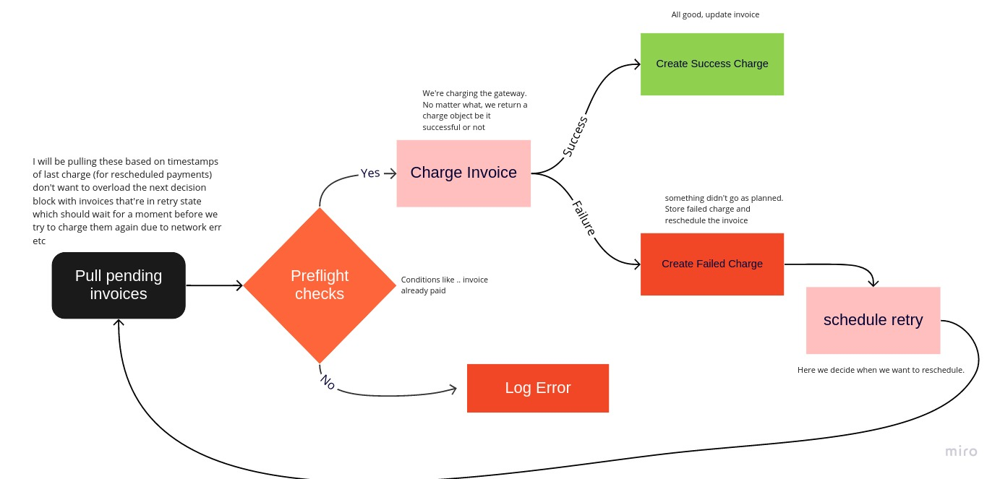

## Preparation Phase

To keep things simple I initially draw this to give myself an idea what I want to build.

What I found is that Kotlin shines best (for me) by the ability of combining both functional and OOP patterns.

This implementation expects that the gateway is idempotent but I think this is usual in the financial world.

Keep in mind this is my first Kotlin code :))

## Features
 - Retry logic
   - Tried to make it extendable and not as simple as 'rety in x'
   - Specific error might have a different retry logic
   - retries grow in time linerally (first retry in 15 mins, then in 30 mins etc)
 - Preflight Checks
   - Before we bill invoice, let's make some validations
 - Charge Object - Fire and not forget when talking to the external Gateway
   - When an actual external request is made to pay the invoice, create a Charge which is Successfull or Unsuccessfull to keep history of charges
 - Pull invoices to be processed using a simple SQL query

## Things that kept me busy :)

 1) Exposed! Had a problem finding a proper documentation
   - I'm pretty sure that the way I'm preloading Charges to an Invoice is not the most efficient and there's probably a single method that does that for me
 2) DateTime. I was spending too much time trying to combine Exposed and Java's datetime so I decided to go with Joda even though I wanted to keep this dependency less :))
 3) Kotlin has Char! I got stucked for good 20 minutes fighting a compiler error when I realised that it all comes down to a second error where the compiler been complainin about using single quote around whole string :D

## Multinode / Scaling this up

Straight from the beginning I knew this is the 'Achilles heel' when running this in production.
Things that popped up to my mind Kafka :hearth: or Akka sound .. it sounded .. logical. 

I wanted to avoid doing something that would be for example locking rows.

I specifically didn't spend too much time on this as in production environment that would be a bit different setup.
And installing Kafka or Akka would be an extremely hard dependency for the test task :))

My initial thinking would be to use Kafka, then I realised that Kotlin is a JVM so Akka could be an option too
A Single producer with many consumers where message UID being the id of the Invoice - to avoid duplicate processing.

## What I think of Kotlin

**The Good**
  - Algebraic type system!
  - Has many functional principles
  - 'easier' Scala but still very powerful
  - Fairly easy to pick-up. Knowing a bit of Scala and Haskell helps a lot
  - Compiler gives helpful error messages ( Unlike Haskell for example :D )

**The bad**
  - I'm sure it would be easier to write this in a Jetbrains IDE rather than in Emacs which I didn't prepare for Kotlin at all (expect syntax highlighting) :)
  - Would like to see more functional types provided by the language. Eg: Either or Maybe I was really missing (they are easy to implement though)
  - I do struggle finding documentation for libraries.
  - jvm :))
  - Would be great to have a function prefix that would mark function without a side effect (pure)
  - I do not fully understand the type system hirearchy, need to read a bit more about that. Eg companion objects, how to properly extend SUM type etc.

I'm actually so happy with the language that I'm considering using it as my primary language for quick personal projects :party:

# Final Thoughts

I did really enjoy doing this. It taught me a lot about Kotlin and I must admit I do like the language quite a bit now. What a pleasant surprise.
I would still like to see a real world app just to give myself a better idea how 'The Kotlin way' looks. Even without it I was suprised how the language handled my thoughts.

I did this in the span of 2 days when I don't count in playing with the language a day before I started just to give myself an idea.
If I recall correctly I started really coding at around 13:30 one Sunday and been on and off coding until about 11o'clock (I still had a normal weekend, cooking, walkin my gf and the dog etc :))
Then a few days later pretty much finished the main logic after work. Maybe another 3 hours?
